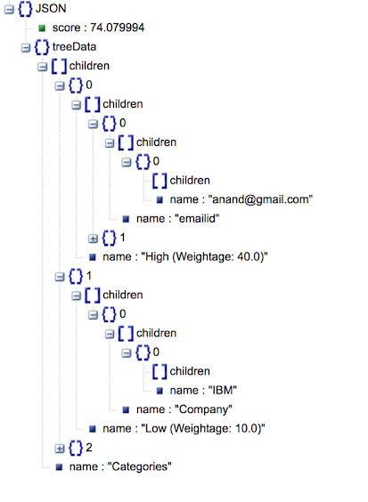

# 구조화되지 않은 일반 문서에서 개인 데이터 채취

*Read this in other languages: [English](README.md).*

개인 정보 보호 규정([General Data Protection Regulation, GDPR](http://terms.naver.com/entry.nhn?docId=3596816&cid=42346&categoryId=42346))은 EU에 도입되는 새로운 규정으로 2018년 5월부터 유효합니다. 이 규정은 EU 시민의 개인 정보를 수집하고 처리하는 (EU 밖에 있는 조직을 포함하여) 모든 조직에 적용됩니다. 이 규정은 개인 데이터 사용에 대한 개인의 통제력을 향상시키는 것을 목표로합니다.

잊혀질 권리 - 새로운 GDPR 규정에서, 전 세계의 모든 조직은 개인 데이터를 보호하는 것에 그치지 않고 개인의 요청에 따라 개인 데이터를 삭제해야 합니다.

이에 따라 고객이 개인 데이터의 삭제를 요청하면, 조직은 고객의 개인 데이터가 있는 모든 문서를 식별해야 합니다. 이 코드 패턴은 제공되는 문서로부터 개인 정보를 식별하는 문제를 해결해 줍니다. 또한 개인 데이터에 대해 고유하게 개인을 식별하는 신뢰 수준을 나타내는 신뢰도 점수를 지정하는 법을 알아봅니다.


아래 예시로 제공된 채팅 내용을 통해 시나리오를 이해해 봅시다.<br />

```
상담원: 안녕하세요. 상담원 토마스 입니다. 무엇을 도와드릴까요?
고객: 저는 알렉스입니다. 제가 사용하고 있는 요금제를 법인 요금제로 바꾸고 싶습니다.
상담원: 네, 제가 도와드리겠습니다. 지금 전화주신 번호의 요금제를 변경하고 싶으신가요?
고객: 네
상담원: 본인 확인을 위해 생년월일과 이메일 주소를 말씀해 주시겠어요?
고객: 생년월일은 1979년 8월 10일이고 이메일 주소는 alex@gmail.com 입니다.
상담원: 어떤 요금제로 바꿔드릴까요?
고객: 450 무제한 요금제요.
상담원: 회사 이름과 입사일을 말씀해 주시겠어요?
고객: IBM이고 99년 2월 1일 입사했습니다.
상담원: 네. 요금제를 450 무제한 요금제로 변경해 드렸습니다. 3시간 이내로 반영될 겁니다. 이 밖에 문의하실 것이 있으신가요?
고객: 없습니다.
상담원: 네 보다폰에 전화주셔서 감사합니다. 좋은 하루 보내세요 !
고객: 네 좋은 하루 보내세요 ~
```

위 내용에서 추출되는 개인 정보는 다음과 같습니다.: <br />

```
이름: 알렉스
생년월일: 10-Aug-1979
이메일: alex@gmail.com
회사: IBM
입사일: 01-Feb-99
```

또한 신뢰도 점수가 계산됩니다.

```
Confidence score: 0.7
```

이 코드 페턴은 다음에 대한 단계별 가이드를 제공합니다.:
- Watson Knowledge Studio (WKS)로 Custom model을 빌드하고 Natural Language Understanding (NLU)로 빌드한 모델을 사용하여 개인 정보를 채취합니다.
- 정규식을 활용하여 구조화되지 않은 데이터에서 개인 정보를 추출합니다.
- 사전에 식별 된 개인 데이터를 가중치로 구성하여 식별된 개인 정보로 개인을 식별하는 신뢰 수준을 나타내는 점수를 계산합니다.
- 식별된 개인 정보와 신뢰도 점수를 Visualization 하여 트리 형태로 보이도록 합니다.
- 다른 애플리케이션에서 이 코드 패턴의 결과를 사용합니다.

# Flow
<br/><br/>
1 – Viewer Component는 Personal Data Extractor에 인풋 텍스트를 넘겨줍니다.<br/>
2 – Personal Data Extractor는 NLU에 넘겨받은 텍스트를 다시 넘겨줍니다.<br/>
3 – 인풋 텍스트로부터 개인 정보가 추출됩니다. NLU는 이러한 결과를 얻기 위해 custom model을 사용합니다.<br/>
4 – Personal Data Extractor는 NLU의 결과물을 Regex component에 전달합니다..<br/>
5 – Regex component는 Configuration을 통해 제공된 정규식을 사용하여 개인 정보를 추출하여 NLU의 아웃풋을 확장합니다.<br/>
6 – 최종적으로 추출된 개인 정보가 scorer component로 넘겨집니다.<br/>
7 – Scorer component는 Configuration을 사용하여 전체적인 문서의 점수를 계산하고 그 결과를 Personal Data Extractor로 다시 넘겨줍니다.<br/>
8 – 이 데이터는 다시 viewer component로 넘겨집니다.<br/>


# 포함된 구성 요소
* [Watson Knowledge Studio](https://cloud.ibm.com/docs/services/knowledge-studio/index.html#wks_overview_full): 특정 산업분야에서 사용하는 언어의 뉘앙스와 의미, 관계를 이해하는 머신 러닝 모델 또는 정의한 룰에 근거하여 문서에서 엔티티를 찾는 룰 기반 모델을 생성하는 툴

* [Watson Natural Language Understanding](https://www.ibm.com/watson/services/natural-language-understanding/): 텍스트 컨텐츠로부터 컨셉, 엔티티, 키워드, 카테고리, 긍부정, 감정, 관계, 의미적 역할 등을 분석하여 메타데이터를 추출하는 IBM Cloud 서비스

* [Liberty for Java](https://cloud.ibm.com/docs/runtimes/liberty/index.html#liberty_runtime): Java 웹 애플리케이션을 쉽게 개발, 배포 및 스케일링 할 수 있는 IBM WebSphere 애플리케이션 서버의 프로파일로 빠르고 가벼워 Cloud 환경에 맞게 설계되었다.


# 영상으로 보기 (영어)

[](https://youtu.be/NiBCa3EtCr0)


# 단계
1. [사전 준비 사항](#1-사전-준비-사항)
2. [컨셉](#2-컨셉)
3. [애플리케이션 배포](#3-애플리케이션-배포)
4. [Watson Knowledge Studio 모델 개발](#4-watson-knowledge-studio-모델-개발)
5. [WKS 모델을 Watson Natural Language Understanding 서비스로 배포](#5-개발한-wks-모델을-watson-natural-language-understanding-서비스로-배포)
6. [환경 변수 수정](#6-환경-변수-수정)
7. [결과 분석](#7-결과-분석)
8. [다른 애플리케이션에서 결과값 사용](#8-다른-애플리케이션에서-결과값-사용)

# 1. 사전 준비 사항
- IBM Cloud 계정: IBM Cloud계정이 없으면 [여기](https://cloud.ibm.com/)에서 계정을 생성하십시오. 이 패턴을 완료하기 위해서는 카드등록을 하여 계정을 Pay as you go 계정으로 업그레이드 해야 합니다. 
- 리버티 애플리케이션을 메뉴얼리 배포하려면 다음을 완료하십시오.
    - Cloud Foundry cli를 [여기](https://docs.cloudfoundry.org/cf-cli/install-go-cli.html)를 참조하여 설치합니다.
    - Maven이 설치되어 있어야 합니다. Maven을 [여기](https://maven.apache.org/download.cgi)에서 다운로드 하고 [여기](https://maven.apache.org/install.html)에서 설치 가이드를 확인하십시오. 
- WKS를 사용하여 모델을 빌드하기 위한 기본 지식을 스터디 합니다.: WKS로 custom model을 빌드하기 위한 기본적인 지식을 갖고 있어야 합니다. [이 문서](https://cloud.ibm.com/docs/services/knowledge-studio/tutorials-create-project.html#wks_tutintro)에서 시작하십시오.


# 2. 컨셉
## 2.1 데이터 추출 방법
먼저 어떤 개인 정보를(예를 들어 이름, 이메일 주소 등) 추출하고 싶은지를 정의해야 합니다. 이 코드 패턴에서 이는 2가지 방식으로 이루어 집니다. <br/>

A) Watson Knowledge Studio (WKS)를 사용한 Custom model을 통해 <br/>
B) 정규식 표현을 통해

이 방법들에 대한 자세한 내용은 이어지는 섹션에서 설명됩니다. <br/><br/>

## 2.2  Configuration을 사용한 방법
개인 정보를 추출하기 위해 Configuration을 사용합니다. 개인 정보는 몇 가지 다른 카테고리로 분류됩니다. 각 카테고리에 Weight 값이 지정됩니다. 또한 어떤 개인 정보가 어떤 카테고리에 속하는지에 대해 정의해야 합니다. <br/>

아래는 샘플 구성입니다.<br/>

```
Categories: Very_High,High,Medium,Low
Very_High_Weight: 50
High_Weight: 40
Medium_Weight: 20
Low_Weight: 10
Very_High_PIIs: MobileNumber,EmailId
High_PIIs: Person,DOB
Medium_PIIs: Name,DOJ
Low_PIIs: Company
regex_params: DOB,DOJ
DOB_regex: (0[1-9]|[12][0-9]|3[01])[- /.](Jan|Feb|Mar|Apr|May|Jun|Jul|Aug|Sep|Oct|Nov|Dec)[- /.](19|20)\d\d
DOJ_regex: (0[1-9]|[12][0-9]|3[01])[- /.](Jan|Feb|Mar|Apr|May|Jun|Jul|Aug|Sep|Oct|Nov|Dec)[- /.]\\d\\d
```

구성을 바꾸고 싶으면 다음의 템플릿을 따르십시오.

```
Categories: <new set of categories which are comma separated>. e.g. Categories: MyCategory1,MyCategory2,MyCategory3
<category_name>_Weight: Weightage for each category. e.g. MyCategory1_Weight: 40
<category>_PIIs: Personal data (Entity types). e.g. MyCategory1_PIIS: EmailId, Employee Id
regex_params: Entity types which have to be extracted using regular expressions. e.g. regex_params:
Date
<regex_param>_regex: Regular expression using which an entity needs to be extracted from text e.g. Date_regex:
(0[1-9]|[12]\[0-9]|3[01])
```

## 2.3 애플리케이션 컴포넌트에 대한 소개
### 2.3.1 Personal Data Extractor component:
Personal Data Extractor 컴포넌트는 다른 모든 컴포넌트와의 데이터 흐름을 제어하고 NLU를 사용하는 컨트롤러의 역할을 하는 애플리케이션 입니다.
### 2.3.2 Regex component:
Regex component는 개인 정보를 추출하기 위해 구성 파일에 제공된 정규식으로 인풋 텍스트를 파싱합니다. 정규식은 개인 정보를 추출하고 NLU의 결과물을 보충하는데에 사용됩니다.
### 2.3.3 Scorer component:
Scorer component는 문서의 점수를 0과 1 사이의 값으로 식별된 개인 정보 및 구성 데이터에 근거하여 계산합니다. 아래 알고리즘을 통하여 점수가 계산됩니다.<br/>

```
Let score be 0
    For each category{
	   cat_weight = weightage for the category
	   cat_entity_types = list of entity types for the category
	   for each cat_entity_types{
	      score = score +( ( cat_weight/100 ) * ( 100 - score ) )
	   }
    }
score = score / 100; // to make it between 0 and 1
```

### 2.3.4 Viewer component:
Viewer component는 애플리케이션의 UI 컴포넌트 입니다. 대화 스크립트를 포함하는 파일을 선택하여 Personal Data Extraction 컴포넌트로 제출합니다. 처리된 개인 데이터는 전체 적인 신뢰도 점수와 함께 트리 뷰로 보여지게 됩니다.
<!--

-->

# 3. 애플리케이션 배포
## 3.1 자바 리버티 애플리케이션을 IBM Cloud로 배포
자바 리버티 애플리케이션을 "Deploy to IBM Cloud" 버튼을 통해 또는 메뉴얼로 배포할 수 있습니다.
### 3.1.1 "Deploy to IBM Cloud" 버튼으로 애플리케이션 배포
애플리케이션을 IBM Cloud로 배포하려면 아래의 "Deploy to IBM Cloud" 버튼을 클릭하십시오. 툴체인 화면이 보여지고 "Deploy"버튼을 클릭하면 애플리케이션이 배포됩니다. 계속 진행하여 배포 버튼을 누르십시오. 애플리케이션이 배포될 것입니다. 애플리케이션이 시작되었는지, NLU 서비스가 생성되고 애플리케이션에 바인드 되었는지를 확인하십시오.

[](https://cloud.ibm.com/devops/setup/deploy?repository=https://github.com/IBM/gdpr-fingerprint-pii.git)

### 3.1.2 메뉴얼로 애플리케이션 배포
`Deploy to IBM Cloud` 버튼으로 애플리케이션을 배포했다면 이 섹션은 스킵하고 [4. Watson Knowledge Studio 모델 개발](#4-watson-knowledge-studio로-모델-개발) 섹션으로 이동하십시오. 메뉴얼로 애플리케이션을 배포하려면 아래의 `3.1.2.1 NLU 서비스 인스턴스 생성` 섹션 및 `3.1.2.2 IBM Cloud에 자바 애플리케이션 배포` 섹션을 모두 완료하십시오.

### 3.1.2.1 NLU 서비스 인스턴스 생성
- Step1: [여기](https://cloud.ibm.com/catalog/services/natural-language-understanding)를 클릭하고 NLU 서비스를 생성하십시오.
- Step2: 아래 스크린이 보여질 것입니다.
  <br/><br/><br/>
- Step3: `Service name:` 필드를 NLUGDPR로 수정하고 다른 설정은 디폴트 상태로 남겨둔 채로 `Create`를 클릭합니다.
  <br/><br/><br/>
- Step4: NLU 서비스 인스턴스가 생성됩니다.

### 3.1.2.2 자바 애플리케이션을 IBM Cloud에 배포
- Step5: 이 [레파지토리](https://github.com/IBM/gdpr-fingerprint-pii)를 Clone 합니다.
- Step6: 커맨드 창을 열어 아래 명령을 사용하여 IBM Cloud 스페이스에 로그인합니다.
  "3.1.2.1 NLU 서비스 인스턴스 생성" 섹션에서 생성한 NLU 서비스 인스턴스와 같은 스페이스에 로그인 하십시오.
```
cf login
```
- Step7: Clone한 레파지토리의 Root 디렉토리로 이동하십시오.
- Step8: 프로젝트의 루트 폴더에 manifest.yml 파일을 확인할 수 있습니다. NLU 서비스의 이름은 위의 Step1에서 생성한 것과 같아야 합니다. 만약 다르다면 NLU 서비스 이름을 위에서 생성한 이름으로 변경하십시오.
  <br/><br/>

- Step9: 다음 명령을 사용해서 war 파일을 빌드합니다.
```
mvn clean package
```

- Step9: 다음 명령으로 자바 리버티 애플리케이션을 배포합니다. IBM Cloud 내에서 겹치지 않을 애플리케이션 이름을 제공하십시오.
```
cf push <unique-application-name> -p target/PersonalDataScorer.war
```
- Step10: IBM Cloud 대시보드에서, 애플리케이션이 성공적으로 배포되고 실행중인지 확인하십시오.
<br/><br/><br/>

- Step11: IBM Cloud 대시보드에서, Step9에서 배포된 애플리케이션을 클릭하십시오. 왼쪽 네비게이션에서 `Connections`를 클릭하십시오. Step3에서 생성한 NLU 서비스가 목록에 있는지 확인하십시오.
<br/><br/>


# 4. Watson Knowledge Studio 모델 개발
## 4.1 필요한 파일 가져오기
### 4.1.1 타입 시스템(Type System)
[여기](https://cloud.ibm.com/docs/services/knowledge-studio/typesystem.html#typesystem)에서 타입 시스템에 대한 자세한 내용을 확인할 수 있습니다.
타입 시스템은 생성할 수도 있고 이미 생성된 것을 JSON 파일 형태로 가져올 수도 있습니다. 자신만의 타입 시스템을 생성하셔도 되고 이 레파지토리에 제공된 타입 시스템의 JSON 파일을 사용해도 됩니다. 타입 시스템 JSON 파일을 Import 하려면 이 레파지토리의 `WKS`에 있는 `TypeSystems.json` 파일을 다운로드 하십시오. 이 JSON 파일은 이름, 휴대폰 번호, 이메일 주소, 주소 등과 같은 엔티티를 가지고 있습니다. 이를 필요에 따라 수정/추가/삭제 하셔도 됩니다.

### 4.1.2 문서(Documents)
[여기](https://cloud.ibm.com/docs/services/knowledge-studio/documents-for-annotation.html#wks_t_docs_intro)에서 문서(Documents)에 대한 더 자세한 내용을 확인할 수 있습니다. 
WKS 모델을 학습시키고 평가하기 위한 문서들이 필요합니다. 문서는 우리가 개인 정보를 식별할 구조화되지 않은 텍스트를 의미합니다. `SampleChatTranscripts` 폴더에 있는 샘플 문서를 확인하십시오. WKS 모델을 학습시키려면 방대하고 다양한 문서가 필요합니다. 이 과정을 시간 내에 완료하기 위해 우리는 아주 적은 양의 데이터만 사용합니다.

가지고 있는 문서 셋을 사용해도 되고 이 git 레파지토리에 제공되는 문서를 사용해도 됩니다. 문서는 `WKS/Documents.zip`에 있습니다. 이 레파지토리에 있는 문서를 사용하려면 이 파일을 다운로드 하십시오.

## 4.2 Watson Knowledge Studio 서비스 인스턴스 생성
[여기](https://cloud.ibm.com/catalog/services/knowledge-studio?taxonomyNavigation=cf-apps)를 클릭하고 Watson Knowledge Studio 서비스 인스턴스를 생성합니다.

<br/><br/>

WKS 툴에 접속하려면 생성된 서비스에서 Launch 버튼을 누릅니다.

<br/><br/>

WKS 툴을 즐겨찾기 해놓으십시오. 다시 이 화면에 접근하려면 대시보드에서 WKS 서비스 인스턴스를 클릭하십시오.

## 4.3 프로젝트 생성
WKS에 툴에서 작업하십시오.
- `Create Workspace`버튼을  클릭합니다..
<br/><br/><br/>
- `Create New Project` 팝업 윈도우에서, 새 프로젝트의 이름을 입력하고 `Create` 버튼을 클릭합니다.
<br/><br/><br/>


## 4.4 타입 시스템 가져오기
- 프로젝트가 생성되면 왼쪽 네비게이션 바에 있는 `Entity Types`를 선택합니다.<br/>
- `Entity Types` 탭에서 `Upload` 버튼을 클릭합니다.
<br/><br/><br/>
- 드래그하는 방식 또는 영역을 클릭하여 파일을 찾는 방식으로 `TypeSystems.json` 파일을 선택합니다. 이 파일은 이 git 레파지로부터 다운로드할 수 있습니다.<br/>
<br/><br/><br/>
- 선택한 파일이 팝업 윈도우에 보여집니다. `Import` 버튼을 클릭합니다.
<br/><br/><br/>
- 아래처럼 문서 목록이 보여질 것입니다. 관심 있는 엔티티 타입과 키워드를 기록하고 추가하거나 수정하십시오. 
<br/><br/><br/>


## 4.5 문서 가져오기
- 왼쪽 네비게이션 바에서 `Documents` 탭을 클릭하십시오.
- `Upload Document Set` 버튼을 클릭합니다.
<br/><br/><br/>
- 팝업 윈도우에서 파일을 드래그 하거나 선택하는 방법으로 `Documents_ko.csv` 파일을 선택합니다. 
- `Upload` 버튼을 클릭합니다.
<br/><br/><br/>
- 문서가 Import된 것을 확인하십시오.


## 4.6 애노테이션 셋 생성 및 담당자 지정
- 애노테이션 셋을 생성하기 위해 `Annotation Sets` 탭을 클릭합니다.
- `Create Annotation Sets` 버튼을 클릭합니다.
<br/><br/><br/>

- Overlap을 60%로 설정합니다. `Add another set and human annotator` 버튼을 클릭하여 애노테이션 셋을 추가합니다. 각 애노테이션 셋에 애노테이터를 할당하고 애노테이션 셋의 이름을 입력합니다. 랩에서는 모두 본인을 할당합니다. “Generate” 버튼을 클릭합니다.
<br/><br/><br/>
- 애노테이션 셋이 다음처럼 생성됩니다.
<br/><br/><br/>


## 4.7 휴먼 애노테이션
- `Task` 탭으로 이동하여 업무를 할당하겠습니다.
- `Add Task` 버튼을 클릭하여 태스크를 생성합니다.
<br/><br/><br/>
- Task의 이름을 입력하고 `Create` 버튼을 클릭합니다.
<br/><br/><br/>
- 팝업 윈도우에서 생성한 애노테이션 셋을 선택합니다.
- `Create Task` 버튼을 클릭합니다.
<br/><br/><br/>
- Task가 생성될 것입니다. 생성된 Task를 선택합니다.
<br/><br/><br/>
- 다음으로 타입 시스템에 정의된 엔티티 타입과 문서에 엔트리를 연결하는 애노테이션 작업을 수행합니다.
- 아무 애노테이션 셋의 `Annotate` 버튼을 클릭합니다.
<br/><br/><br/>
- `Document Annotation` 탭으로 이동됩니다. 애노테이션 하려는 애노테이션 셋을 선택하고 문서를 선택합니다.
<br/><br/><br/>
- 문서에서 엔티티로 추출하고 싶은 엔트리를 선택한 후에 스크린의 오른쪽에서 엔티티 타입을 클릭합니다.
- 문서의 모든 키워드에 대해 이와 유사하게 수행하십시오.
<br/><br/><br/>
- 모든 키워드를 엔티티 타입에 매핑한 후에 Status 드롭다운 버튼을 클릭하여 상태를 `Completed`로 변경합니다.
<br/><br/><br/>
- 변경 사항을 저장하려면 `Save` 아이콘을 클릭합니다.
- 모든 문서에 대해 위의 단계를 반복합니다. 모든 문서의 상태가 `Completed`로 마크되어야 합니다. 애노테이터 간의 충돌을 보려면 고의로 약간 다르게 작업합니다.
- 모든 문서에 대해 애노테이션을 마치면 다시 `Asset & Tools > Documents > Tasks` 탭로 이동하여 Task를 클릭합니다.
- Status 정보가 `SUBMITTED`로 바뀌었을 것입니다.
- 두 애노테이션 셋을 선택하고 `Calculate Inter-Annotator Agreement`를 클릭합니다.
<br/><br/><br/>
- 다음과 같이 애노테이션 간에 얼마나 다르게 작업했는지에 대한 정보를 확인할 수 있습니다.
- `Back to GDPRAnnotationTask` 버튼을 클릭하여 이전 화면으로 돌아갑니다.
<br/><br/><br/>
- 두 애노테이션 셋을 선택하고 `Accept` 버튼을 클릭합니다.
<br/><br/><br/>
- 다음과 같이 충돌이 일어난 경우 `Check Overlapping Documents for Conflict`를 클릭합니다.
<br/><br/><br/>
- 목록에서 충돌을 해결하려는 문서의 `Check for Conflicts` 버튼을 클릭합니다.
<br/><br/><br/>
- 다음과 같이 충돌이 일어난 부분에서 잘못 표기한 애노테이션을 선택하고 `Reject`버튼을 클릭하여 삭제합니다.
- 충돌을 모두 해결했거나 충돌이 없는 문서는 우측 상단의 `Promote to Ground Truth` 아이콘을 눌러 작업한 내용을 저장합니다.
- 모든 문서에 대해 위의 작업을 반복합니다. 
<br/><br/><br/>
- 모든 중복된 문서에 대해 작업을 다음처럼 완료하면 됩니다.
<br/><br/><br/>
- `Back to GDPRAnnotationTask Task` 버튼을 클릭하여 이전 화면으로 이동합니다.
- Task의 상태가 `COMPLETED`로 변경된 것을 확인할 수 있습니다.
<br/><br/><br/>
- `Model Management > Performance` 페이지로 이동합니다.
- `Train and evaluate` 버튼을 클릭합니다.
<br/><br/><br/>
- Task를 통해 완료된 문서 셋을 클릭하고 `Train & Evaluate` 버튼을 클릭합니다.
<br/><br/><br/>
- 트레이닝 및 평가 프로세스가 시작됩니다. 완료될 때 까지 기다립니다.
<br/><br/><br/>

# 5. 개발한 WKS 모델을 Watson Natural Language Understanding 서비스로 배포
- 사전준비사항 단계에서 기록해둔 로그인 URL로 WKS에 로그인 하십시오. `Model Management > Versions` 페이지로 이동합니다. `Take Snapshot` 버튼을 눌러 스냅샷을 생성합니다. 팝업창이 뜨면 `OK`버튼을 누릅니다.
<br/><br/><br/>
- 스냅샷의 Action열에 있는 `Deploy`버튼을 클릭합니다.
<br/><br/><br/>
- `Natural Language Understanding`을 선택하고 `Next`를 클릭합니다.
<br/><br/><br/>
- 애플리케이션 배포시 사용했던 Region, Space 및 NLU 서비스 인스턴스를 선택하고 `Deploy`를 클릭합니다.
<br/><br/><br/>
- WKS 모델이 NLU로 디플로이 됩니다. 이 때 모델 ID를 기록해 두고 "OK"를 클릭합니다.
<br/><br/><br/>
- 모델이 NLU로 디플로이 되었습니다.
<br/><br/><br/>


# 6. 환경 변수 수정
- IBM Cloud 대시보드로 접속하십시오. 배포된 GDPR 애플리케이션을 클릭합니다.
<br/><br/><br/>
- “Runtime”을 클릭합니다.
<br/><br/><br/>
- “Environment Variables”를 클릭하고 스크롤을 내려 사용자 정의 변수(User Defiend Variables)로 이동합니다.
<br/><br/><br/>
- `wks_model` 키로 저장된 모델 아이디를 업데이트 하십시오. 다른 Configuration 데이터를 여기서 변경할 수도 있습니다. 필요한 대로 변경하십시오. 변경 후에 `Save`버튼을 눌러 저장합니다.
<br/><br/><br/>
- 애플리케이션이 재시작됩니다. 애플리케이션이 실행되면 구조화되지 않은 텍스트 데이터로부터 개인 정보와 점수를 추출하는 애플리케이션을 사용할 수 있습니다. `Routes`버튼을 눌러 애플리케이션 URL을 확인할 수 있습니다.
<br/><br/>


# 7. 결과 분석
- 이 github 레파지토리에서 샘플 채팅 데이터인 `SampleChatTranscripts_ko` 폴더를 다운로드 하십시오.
- 브라우저에서 애플리케이션 URL을 오픈합니다.
<br/><br/><br/>
- `Choose File` 버튼을 누르고 위 단계에서 다운로드한 샘플 채팅 데이터를 선택한 후 `Open`을 클릭합니다.
- 아래와 같이 접힌 트리뷰의 형태가 보일 것입니다.
<br/><br/><br/>
- 노드를 확장하려면 노드를 클릭합니다. 모두 확장하면 다음과 같은 트리뷰가 보여집니다.
<br/><br/>


# 8. 다른 애플리케이션에서 결과 사용하기
- 이 애플리케이션은 두개의 REST 인터페이스를 제공합니다. <br />
/rest/personaldata/forviewer <br/>
/rest/personaldata/forconsumer<br/>

이 두 인터페이스는 다른 사용 목적을 갖고 있으며 아웃풋도 다르게 포맷되어 있습니다. 첫번째 것은 viewer component에 의해 사용되며 D3 투리뷰에 사용되빈다. 두번째 것은 좀 더 일반적인데 이 데이터를 소비하고자 하는 모든 애플리케이션에서 사용 가능합니다.
<br/>
첫번째 인터페이스의 JSON 아웃풋은 아래 이미지와 같습니다.br/>
<br/>
<br/><br/>
두번째 인터페이스인 일반적인 JSON 아웃풋은 아래 이미지와 같습니다.
<br/>
<br/><br/>


# 참고 자료
*


# 학습 자료
- **인공 지능 코드 패턴:** 이 코드 패턴이 도움이 되셨나요? 다른 [인공 지능 코드 패턴](https://developer.ibm.com/code/technologies/artificial-intelligence/)도 확인해 보세요.
- **인공 지능 코드 패턴 관련 동영상 리스트:** 코드 패턴의 동영상이 있는 [동영상 리스트](https://www.youtube.com/playlist?list=PLzUbsvIyrNfknNewObx5N7uGZ5FKH0Fde)를 즐겨찾기 해놓으십시오.


# 라이센스
[Apache 2.0](LICENSE)
