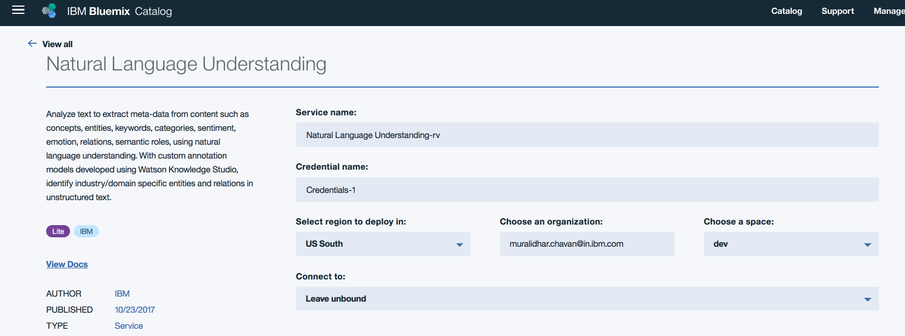
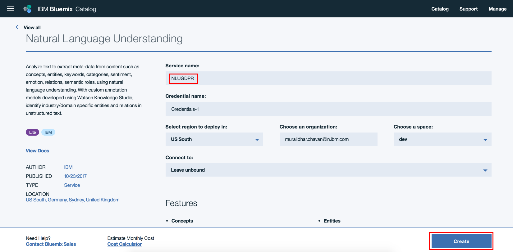
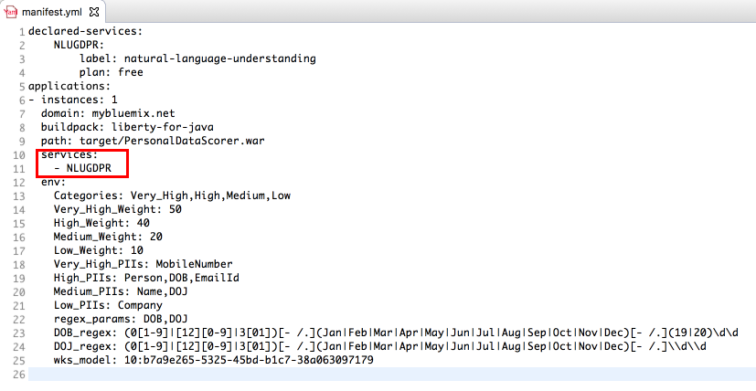
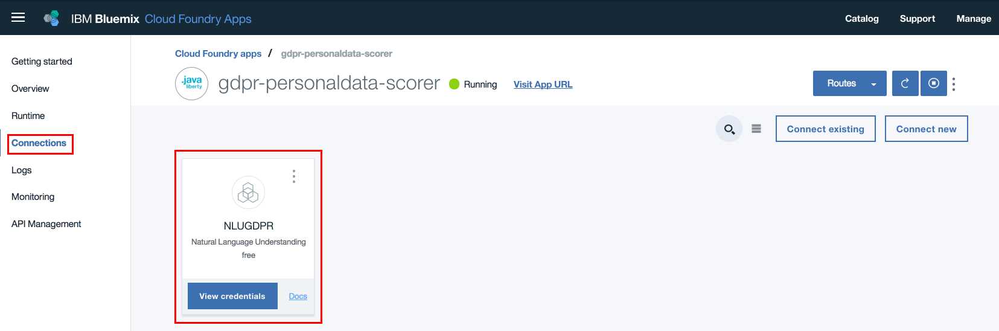
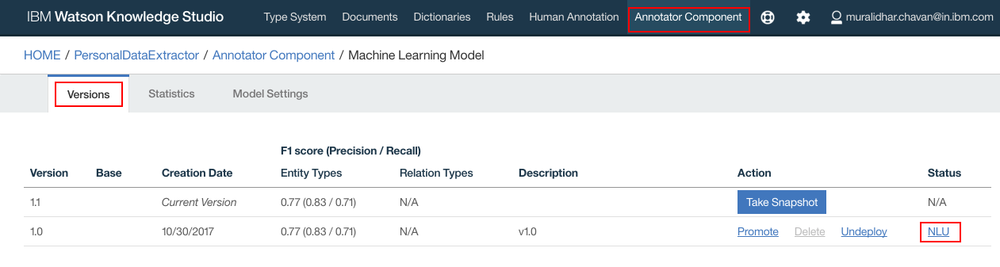
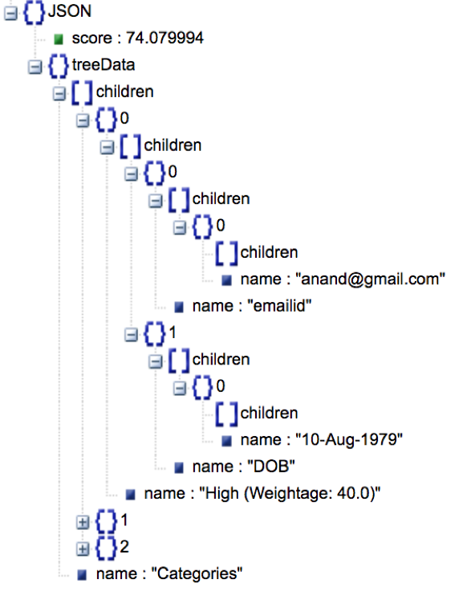
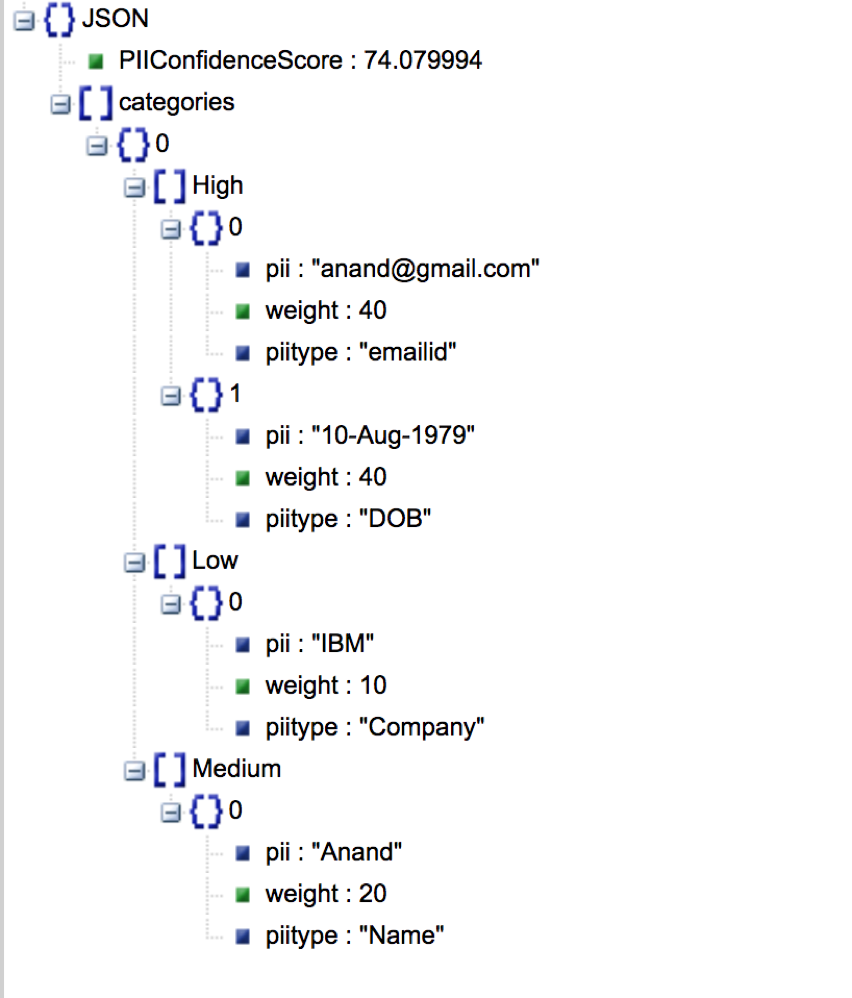

# Fingerprinting personal data from unstructured documents

The General Data Protection Regulation (GDPR) is a regulation by which the European 
Parliament, the Council of the European Union and the European Commission intend to 
strengthen and unify data protection for all individuals within the European Union 
(EU). It also addresses the export of personal data outside the EU. 

Under the EU's new General Data Protection Regulation, enterprises around the world 
must not only keep personal data private, but they will also be required to "forget" 
any personal data related to an individual on request -- and the GDPR right to be forgotten 
will be a significant part of compliance with the new rule. 

When a customer requests that all his or her personal data be deleted, then an organisation 
needs to identify all the documents where the customer's personal data reside. This 
code pattern addresses the need to identify the personal data from the provided documents. 
Also, we will see how to assign a confidence score for the personal data that indicates 
the confidence level in identifying an individual uniquely as part of the code pattern.

Let us try to understand this with an example chat transcript as below<br />

```
Rep: This is Thomas. How can I help you?
Caller: This is Alex. I want to change my plan to corporate plan
Rep: Sure, I can help you. Do you want to change the plan for the number from which you are calling now?
Caller: yes
Rep: For verification purpose may I know your date of birth and email id
Caller: My data of birth is 10-Aug-1979 and my email id is alex@gmail.com
Rep: Which plan do you want to migrate to
Caller: Plan 450 unlimited
Rep: Can I have your company name and date of joining
Caller: I work for IBM and doj 01-Feb-99
Rep: Ok.. I have taken your request to migrate plan to 450 unlimited. You will get an update in 3 hours. Is there anything else that I can help you with
Caller: No
Rep: Thanks for calling Vodaphone. Have a good day
Caller: you too
```

Personal Data extracted from the above text: <br />

```
Name: Alex
Date of birth: 10-Aug-1979
Email id: alex@gmail.com
Company: IBM
Date of joining: 01-Feb-99
```

Also the confidence score is calculated

```
Confidence score: 0.7
```


This code pattern gives you a step by step instructions for:
- Building a custom model using Watson Knowledge Studio (WKS) and having Natural Language 
Understanding (NLU) use that model for personal data extraction.
- Using regular expressions, in addition to NLU, to extract personal data from unstructured 
text.
- Configuring pre-identified personal data with weightage and coming up with a score 
representing the confidence level of identifying an individual using the personal data 
identified.
- Viewing the score and the personal data identified in a tree structure for better 
visualization.
- Consuming the output of this code pattern by other applications.

# Flow
<br/><br/>
1 – Viewer passes input text to Personal Data Extractor.<br/>
2 – Personal Data Extractor passes the text to NLU.<br/>
3 – Personal Data extracted from the input text. NLU uses custom model to provide the response.<br/>
4 – Personal Data Extractor passes NLU Output to Regex component.<br/>
5 – Regex component uses the regular expressions provided in configuration to extract personal data which is then augmented to the NLU Output.<br/>
6 – The augmented personal data is passed to scorer component.<br/>
7 – Scorer component uses the configuration to come up with a overall document score and the result is passed back to Personal Data Extractor component.<br/>
8 – This data is then passed to viewer component.<br/>


# Included Components
* [Watson Knowledge Studio](https://console.bluemix.net/docs/services/knowledge-studio/index.html#wks_overview_full): 
  A tool to create a machine-learning model that understands the linguistic nuances, 
  meaning, and relationships specific to your industry or to create a rule-based model 
  that finds entities in documents based on rules that you define.

* [Watson Natural Language Understanding](https://www.ibm.com/watson/services/natural-language-understanding/): 
  A Bluemix service that can analyze text to extract meta-data from content such as 
  concepts, entities, keywords, categories, sentiment, emotion, relations, semantic 
  roles, using natural language understanding.

* [Liberty for Java](https://console.bluemix.net/docs/runtimes/liberty/index.html#liberty_runtime): 
Develop, deploy, and scale Java web apps with ease. IBM WebSphere Liberty Profile is 
a highly composable, ultra-fast, ultra-light profile of IBM WebSphere Application Server 
designed for the cloud.


# Watch the Overview Video

[](https://youtu.be/NiBCa3EtCr0)


# Steps
1. [Prerequisites](#1-prerequisites)
2. [Concepts used](#2-concepts-used)
3. [Application deployment](#3-application-deployment)
4. [Develop Watson Knowledge Studio model](#4-develop-watson-knowledge-studio-model)
5. [Deploy WKS model to Watson Natural Language Understanding](#5-deploy-wks-model-to-watson-natural-language-understanding)
6. [Verify that configuration parameters are correct](#6-verify-that-configuration-parameters-are-correct)
7. [Analyze results](#7-analyze-results)
8. [Consuming the output by other applications](#8-consuming-the-output-by-other-applications)


### 1. Prerequisites
- Bluemix account: If you do not have a Bluemix account, you can create an account [here](https://console.bluemix.net/).
- If you opt to deploy the Liberty application manually then 
    - Cloud Foundry cli should be installed. If not installed, click [here](https://docs.cloudfoundry.org/cf-cli/install-go-cli.html) for 
      instructions install.
    - Maven should be installed. If not installed, you can download Maven from [here](https://maven.apache.org/download.cgi). You 
      can refer to installation instructions [here](https://maven.apache.org/install.html).
- Watson Knowledge Studio account: User must have a WKS account. If you do not have 
  an account, you can create a free account [here](https://www.ibm.com/account/us-en/signup/register.html?a=IBMWatsonKnowledgeStudio).
- Basic knowledge of building models in WKS: The user must possess basic knowledge 
  of building model in WKS in order to build a custom model.

### 2. Concepts used
#### 2.1 Data extraction methods
We have to define what personal data (e.g. Name, Email id) we would want to extract. This is done in two ways in this code pattern. <br/>
A) Using Custom model build using Watson Knowledge Studio (WKS) and <br/>
B) Using regular expressions. Details of how these are used are explained later in subsequent 
sections.<br/><br/>
#### 2.2  Configuration
We use configuration to extract personal data. Personal data are classified into different 
categories. Each category is assigned a weight. Also we specify what personal data 
belongs to which category. <br/>

A sample configuration is as shown below <br/>

```
Categories: Very_High,High,Medium,Low
Very_High_Weight: 50
High_Weight: 40
Medium_Weight: 20
Low_Weight: 10
Very_High_PIIs: MobileNumber,EmailId
High_PIIs: Person,DOB
Medium_PIIs: Name,DOJ
Low_PIIs: Company
regex_params: DOB,DOJ
DOB_regex: (0[1-9]|[12][0-9]|3[01])[- /.](Jan|Feb|Mar|Apr|May|Jun|Jul|Aug|Sep|Oct|Nov|Dec)[- /.](19|20)\d\d
DOJ_regex: (0[1-9]|[12][0-9]|3[01])[- /.](Jan|Feb|Mar|Apr|May|Jun|Jul|Aug|Sep|Oct|Nov|Dec)[- /.]\\d\\d
```

If you want to change configuration, then follow the below template 

```
Categories: <new set of categories which are comma separated>. e.g. Categories: MyCategory1,MyCategory2,MyCategory3
<category_name>_Weight: Weightage for each category. e.g. MyCategory1_Weight: 40 
<category>_PIIs: Personal data (Entity types). e.g. MyCategory1_PIIS: EmailId, Employee Id
regex_params: Entity types which have to be extracted using regular expressions. e.g. regex_params: 
Date
<regex_param>_regex: Regular expression using which an entity needs to be extracted from text e.g. Date_regex: 
(0[1-9]|[12]\[0-9]|3[01])
```

#### 2.3 Brief description of application components
##### 2.3.1 Personal Data Extractor component:
Personal Data Extractor component is the controller which controls the flow of data 
between all the components. It also integrates with NLU.
##### 2.3.2 Regex component:
Regex component parses the input text using the regular expressions provided in the 
configuration files to extract personal data. Regular expressions are used to extract 
personal data to augment NLU output.
##### 2.3.3 Scorer component:
Scorer component calculates the score of a document, which is between 0 and 1, based 
on the personal data identified and the configuration data. It uses the below algorithm<br/>

```
Let score be 0
    For each category{
	   cat_weight = weightage for the category
	   cat_entity_types = list of entity types for the category
	   for each cat_entity_types{
	      score = score +( ( cat_weight/100 ) * ( 100 - score ) )
	   }
    }
score = score / 100; // to make it between 0 and 1
```

##### 2.3.4 Viewer component:
Viewer component is the user interface component of the application. User can browse 
a file, containing chat transcript, and submit to personal data extraction component. 
After processed personal data are then shown in a tree view, along with the 
overall confidence score. <br/>
<!--

-->

### 3. Application deployment
#### 3.1 Deploy Java Liberty application to Bluemix
You can deploy the Java Liberty application using the "Deploy to Bluemix" button or 
using manual steps.
##### 3.1.1 Deploy using "Deploy to Bluemix"
Click "Deploy to Bluemix" button above to deploy the application to Bluemix. You would 
be presented with a toolchain view and asked to "Deploy" the application. Go ahead and 
click deploy button. The application should get deployed. Ensure that the application 
is started and that a NLU service is created and bound to the application just deployed. <br/>
[](https://bluemix.net/deploy?repository=https://github.com/IBM/gdpr-fingerprint-pii.git)
##### 3.1.2 Deploy using Manual steps
If you have used "Deploy to Bluemix" button to deploy the application, then skip this 
section and junk to section "4. Develop Watson Knowledge Studio model". If you have 
not used "Deploy to Bluemix" button to deploy the application, then complete the sections 
"3.1.2.1 Create NLU service instance" and "3.1.2.2 Deploy the Java application on Bluemix" 
below.
###### 3.1.2.1 Create NLU service instance
- Step1: Click [here](https://console.bluemix.net/catalog/services/natural-language-understanding) 
to create NLU service
- Step2: Below screen is displayed
  <br/><br/><br/>
- Step3: Edit the field "Service name:" to say NLUGDPR and leave the other settings default. 
  Click "Create"
  <br/><br/><br/>
- Step4: NLU service instance should get created.
###### 3.1.2.2 Deploy the Java application on Bluemix
- Step5: Clone the [repo](https://github.com/IBM/gdpr-fingerprint-pii)
- Step6: Open command prompt. Login to your Bluemix space using the below command. 
  Ensure that you login to same space where NLU service instance was created in section 
  "3.1.2.1 Create NLU service instance"
```
cf login
```
- Step7: Change directory to the cloned repo's root directory
- Step8: You will find manifest.yml file at the project's root folder. Verify if the 
NLU service name is same as the one created in Step1 above. If not, update the NLU 
service name to the one created above
  <br/><br/>

- Step9: Build war file using the command
```
mvn clean package
```

- Step9: Deploy the Java Liberty Application using the below command
```
cf push gdpr-personaldata-scorer -p target/PersonalDataScorer.war
```
- Step10: On the Bluemix dashboard, ensure that the application is deployed successfully and is running. 
<br/><br/><br/>

- Step11: On the Bluemix dashboard, click on the application that was deployed in Step9. 
On the left hand side navigation links click "Connections". Verify that the NLU service 
created in Step3 is listed
<br/><br/>


### 4. Develop Watson Knowledge Studio model
Detailed steps to create a model in WKS is provided [here](https://github.ibm.com/IBMCode/howtos/tree/master/extracting-personal-data-from-unstructured-text-using-watson-knowledge-studio). 
This is a how-to guide.

### 5. Deploy WKS model to Watson Natural Language Understanding
- In WKS, navigate to "Annotator Component" and Click on NLU
<br/><br/><br/>
- Click “Details”
<br/><br/><br/>
- Click “Take Snapshot”
<br/><br/><br/>
- Enter any meaningful description for the snapshot. Click “OK”
<br/><br/><br/>
- Snapshot is created
<br/><br/><br/>
- Click “Deploy” to deploy on the NLU service that was created in earlier steps in this document. Click “Deploy”
<br/><br/><br/>
- Select “Natural Language Understanding”. Click “Next”
<br/><br/><br/>
- Select your Bluemix Region, Space and NLU service instances. Click “Deploy”
<br/><br/><br/>
- WKS model should get deployed on the NLU. Make a note of the Model Id. Click “OK”
<br/><br/><br/>
- Model is deployed to NLU
<br/><br/>


### 6. Verify that configuration parameters are correct
- Navigate to the Bluemix dashboard. Click on the GDPR application that is deployed
<br/><br/><br/>
- Click “Runtime”
<br/><br/><br/>
- Click “Environment Variables” and scroll down to user defined variables
<br/><br/><br/>
- Update the model id against “wks_model” entry. Also here is where you will update all your configuration data. Update/edit all the configuration data as required. Finally verify that all other configuration parameters are correct. Click “Save”
<br/><br/><br/>
- The application restages. When the application is running, we are ready to use the application to extract personal data and score them from unstructured text
<br/><br/>


### 7. Analyze Results
- From the github repo for this Pattern, download sample chat transcripts, from 
  the folder "SampleChatTranscripts", on to your local file system
- Open the application URL from a browser
<br/><br/><br/>
- Click "Choose File". On the popup window browse to any chat transcript that you downloaded in 2 steps above and select it. Click "Open"
- Initially you see a collapsed tree view as below
<br/><br/><br/>
- Click on nodes to expand and collapse the nodes. Full tree view looks as below
<br/><br/>


### 8. Consuming the output by other applications
- This application exposes two REST interfaces <br />
/rest/personaldata/forviewer and <br/>
/rest/personaldata/forconsumer<br/>
The two have differently formatted output for different usage purposes. While the former is used by viewer, in D3 tree view, the latter is more generic and can be invoked by any application for consumption. <br/>
Viewer Output JSON looks as in the below image<br/>
<br/><br/><br/>
Generic Output JSON looks as in the below image<br/>
<br/><br/>


# References
* 

# License
[Apache 2.0](LICENSE)
