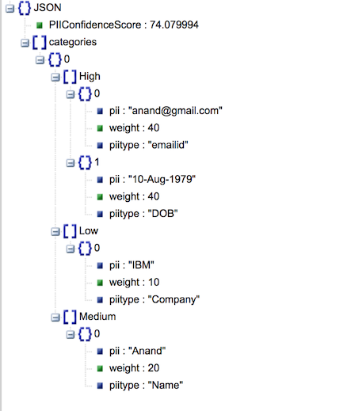

# Fingerprinting personal data from unstructured documents

*Read this in other languages: [한국어](README-ko.md).*

General Data Protection Regulation (GDPR) will be a new regulation in EU which will come into effect in May 2018. This new regulation applies to those organizations, including those outside EU, which collect and process personal data. It aims to give more control to individuals over usage of their personal data.

Right to forget - Under the new GDPR, organizations around the world must not only protect personal data but also forget personal data on request from individuals.

When a customer requests that all his or her personal data be deleted, then an organisation needs to identify all the documents where the customer's personal data reside. This code pattern addresses the need to identify the personal data from the provided documents. Also, we will see how to assign a confidence score for the personal data that indicates the confidence level in identifying an individual uniquely as part of the code pattern.

Let us try to understand this with an example chat transcript as below

```
Rep: This is Thomas. How can I help you?
Caller: This is Alex. I want to change my plan to corporate plan
Rep: Sure, I can help you. Do you want to change the plan for the number from which you are calling now?
Caller: yes
Rep: For verification purpose may I know your date of birth and email id
Caller: My data of birth is 10-Aug-1979 and my email id is alex@gmail.com
Rep: Which plan do you want to migrate to
Caller: Plan 450 unlimited
Rep: Can I have your company name and date of joining
Caller: I work for IBM and doj 01-Feb-99
Rep: Ok.. I have taken your request to migrate plan to 450 unlimited. You will get an update in 3 hours. Is there anything else that I can help you with
Caller: No
Rep: Thanks for calling Vodaphone. Have a good day
Caller: you too
```

Personal Data extracted from the above text:

```
Name: Alex
Date of birth: 10-Aug-1979
Email id: alex@gmail.com
Company: IBM
Date of joining: 01-Feb-99
```

Also the confidence score is calculated

```
Confidence score: 0.7
```

This code pattern gives you a step by step instructions for:
- Building a custom model using Watson Knowledge Studio (WKS) and having Natural Language Understanding (NLU) use that model for personal data extraction.
- Using regular expressions, in addition to NLU, to extract personal data from unstructured text.
- Configuring pre-identified personal data with weightage and coming up with a score representing the confidence level of identifying an individual using the personal data identified.
- Viewing the score and the personal data identified in a tree structure for better visualization.
- Consuming the output of this code pattern by other applications.

## Flow


1. Viewer passes input text to Personal Data Extractor.
2. Personal Data Extractor passes the text to NLU.
3. Personal Data extracted from the input text. NLU uses custom model to provide the response.
4. Personal Data Extractor passes NLU Output to Regex component.
5. Regex component uses the regular expressions provided in configuration to extract personal data which is then augmented to the NLU Output.
6. The augmented personal data is passed to scorer component.
7. Scorer component uses the configuration to come up with a overall document score and the result is passed back to Personal Data Extractor component.
8. This data is then passed to viewer component.


## Included Components
* [Watson Knowledge Studio](https://cloud.ibm.com/docs/services/knowledge-studio/index.html#wks_overview_full):
  A tool to create a machine-learning model that understands the linguistic nuances, meaning, and relationships specific to your industry or to create a rule-based model that finds entities in documents based on rules that you define.

* [Watson Natural Language Understanding](https://www.ibm.com/watson/services/natural-language-understanding/):
  An IBM Cloud service that can analyze text to extract meta-data from content such as concepts, entities, keywords, categories, sentiment, emotion, relations, semantic roles, using natural language understanding.

* [Liberty for Java](https://cloud.ibm.com/docs/runtimes/liberty/index.html#liberty_runtime):
Develop, deploy, and scale Java web apps with ease. IBM WebSphere Liberty Profile is a highly composable, ultra-fast, ultra-light profile of IBM WebSphere Application Server designed for the cloud.


## Watch the Overview Video

[](https://youtu.be/NiBCa3EtCr0)


## Steps
1. [Prerequisites](#1-prerequisites)
2. [Concepts used](#2-concepts-used)
3. [Application deployment](#3-application-deployment)
4. [Develop Watson Knowledge Studio model](#4-develop-watson-knowledge-studio-model)
5. [Deploy WKS model to Watson Natural Language Understanding](#5-deploy-wks-model-to-watson-natural-language-understanding)
6. [Verify that configuration parameters are correct](#6-verify-that-configuration-parameters-are-correct)
7. [Analyze results](#7-analyze-results)
8. [Consuming the output by other applications](#8-consuming-the-output-by-other-applications)


### 1. Prerequisites
- IBM Cloud account: If you do not have an IBM Cloud account, you can create an account [here](https://cloud.ibm.com/).
- If you opt to deploy the Liberty application manually then
    - Cloud Foundry cli should be installed. If not installed, click [here](https://docs.cloudfoundry.org/cf-cli/install-go-cli.html) for instructions to install.
- Watson Knowledge Studio account: User must have a WKS account. If you do not have
  an account, you can create a free account [here](https://www.ibm.com/account/us-en/signup/register.html?a=IBMWatsonKnowledgeStudio).
  Make a note of the login URL since it is unique to every login id
- Basic knowledge of building models in WKS: The user must possess basic knowledge
  of building model in WKS in order to build a custom model. Check getting started documentation [here](https://cloud.ibm.com/docs/services/knowledge-studio/tutorials-create-project.html#wks_tutintro)


### 2. Concepts used

#### 2.1 Data extraction methods

We have to define what personal data (e.g. Name, Email id) we would want to extract. This is done in two ways in this code pattern.
A) Using Custom model built using Watson Knowledge Studio (WKS) and
B) Using regular expressions. Details of how these are used are explained in subsequent
sections.

#### 2.2  Configuration

We use configuration to extract personal data. Personal data are classified into different
categories. Each category is assigned a weight. Also we specify what personal data
belongs to which category.

A sample configuration is as shown below

```
Categories: Very_High,High,Medium,Low
Very_High_Weight: 50
High_Weight: 40
Medium_Weight: 20
Low_Weight: 10
Very_High_PIIs: MobileNumber,EmailId
High_PIIs: Person,DOB
Medium_PIIs: Name,DOJ
Low_PIIs: Company
regex_params: DOB,DOJ
DOB_regex: (0[1-9]|[12][0-9]|3[01])[- /.](Jan|Feb|Mar|Apr|May|Jun|Jul|Aug|Sep|Oct|Nov|Dec)[- /.](19|20)\d\d
DOJ_regex: (0[1-9]|[12][0-9]|3[01])[- /.](Jan|Feb|Mar|Apr|May|Jun|Jul|Aug|Sep|Oct|Nov|Dec)[- /.]\\d\\d
```

If you want to change configuration, then follow the below template

```
Categories: <new set of categories which are comma separated>. e.g. Categories: MyCategory1,MyCategory2,MyCategory3
<category_name>_Weight: Weightage for each category. e.g. MyCategory1_Weight: 40
<category>_PIIs: Personal data (Entity types). e.g. MyCategory1_PIIS: EmailId, Employee Id
regex_params: Entity types which have to be extracted using regular expressions. e.g. regex_params:
Date
<regex_param>_regex: Regular expression using which an entity needs to be extracted from text e.g. Date_regex:
(0[1-9]|[12]\[0-9]|3[01])
```

#### 2.3 Brief description of application components

##### 2.3.1 Personal Data Extractor component:

Personal Data Extractor component is the controller which controls the flow of data
between all the components. It also integrates with NLU.

##### 2.3.2 Regex component:

Regex component parses the input text using the regular expressions provided in the
configuration files to extract personal data. Regular expressions are used to extract
personal data to augment NLU output.

##### 2.3.3 Scorer component:

Scorer component calculates the score of a document, which is between 0 and 1, based
on the personal data identified and the configuration data. It uses the below algorithm

```
Let score be 0
    For each category{
	   cat_weight = weightage for the category
	   cat_entity_types = list of entity types for the category
	   for each cat_entity_types{
	      score = score +( ( cat_weight/100 ) * ( 100 - score ) )
	   }
    }
score = score / 100; // to make it between 0 and 1
```

##### 2.3.4 Viewer component:

Viewer component is the user interface component of the application. User can browse a file, containing chat transcript, and submit to personal data extraction component. After processed personal data are then shown in a tree view, along with the overall confidence score.


### 3. Application deployment

#### 3.1 Deploy Java Liberty application to IBM Cloud

You can deploy the Java Liberty application using the `Deploy to IBM Cloud` button or
using manual steps.

##### 3.1.1 Deploy using "Deploy to IBM Cloud"

Click `Deploy to IBM Cloud` button above to deploy the application to IBM Cloud. You would
be presented with a toolchain view and asked to "Deploy" the application. Go ahead and
click `Deploy` button. The application should get deployed. Ensure that the application
is started and that a NLU service is created and bound to the application just deployed. 
[](https://cloud.ibm.com/devops/setup/deploy?repository=https://github.com/IBM/gdpr-fingerprint-pii.git&branch=ProcessChanges)

##### 3.1.2 Deploy using Manual steps

If you have used `Deploy to IBM Cloud` button to deploy the application, then skip this
section and jump to section "4. Develop Watson Knowledge Studio model". If you have
not used `Deploy to IBM Cloud` button to deploy the application, then complete the sections
"3.1.2.1 Create NLU service instance" and "3.1.2.2 Deploy the Java application on IBM Cloud"
below.

###### 3.1.2.1 Create NLU service instance

- Step1: Click [here](https://cloud.ibm.com/catalog/services/natural-language-understanding) to create NLU service
- Step2: Below screen is displayed

- Step3: Edit the field "Service name:" to say NLUGDPR and leave the other settings default.
  Click `Create`

- Step4: NLU service instance should get created.

###### 3.1.2.2 Deploy the Java application on IBM Cloud

- Step5: Clone the [repo](https://github.com/IBM/gdpr-fingerprint-pii)
- Step6: Open command prompt. Login to your IBM Cloud space using the below command.
  Ensure that you login to same space where NLU service instance was created in section
  "3.1.2.1 Create NLU service instance"
```
cf login
```
- Step7: Change directory to the cloned repo's root directory
- Step8: You will find manifest.yml file at the project's root folder. Verify if the
NLU service name is same as the one created in Step1 above. If not, update the NLU
service name to the one created above


- Step9: Deploy the Java Liberty Application using the below command. Provide a unique application name so that the route is not already taken in IBM Cloud.
```
cf push <unique-application-name> -p deployables/PersonalDataScorer.war
```
- Step10: On IBM Cloud dashboard, ensure that the application is deployed successfully and is running.


- Step11: On IBM Cloud dashboard, click on the application that was deployed in Step9.
On the left hand side navigation links click `Connections`. Verify that the NLU service created in Step3 is listed. If not listed, manually create a connection to NLU service. Restage the application, if prompted for.


- Step11: Ensure that the entries, under `env` in manifest.yml are updated in apps runtime -> user defined variables. If not available, manually update the variables as available in manifest file. Restage the application, if prompted for.


### 4. Develop Watson Knowledge Studio model

## 4.1 Import Artifacts

### 4.1.1 Type Systems

You can learn more about Type Systems [here](https://cloud.ibm.com/docs/services/knowledge-studio/typesystem.html#typesystem)
Type Systems can either be created or imported from an already created Type Systems json file. It is left to user to create his or her own Type systems or use a Type Systems json file provided in this repository. If you wish to import the Type Systems json file, then download the file named `TypeSystems.json` under the folder `WKS` in this repository to your local file system. The json file has entity types such as Name, PhoneNo, EmailId, Address. You can edit/add/delete entity types to suit your requirement.

### 4.1.2 Documents

You can learn more about Documents [here](https://cloud.ibm.com/docs/services/knowledge-studio/documents-for-annotation.html#wks_t_docs_intro)
We will need a set of documents to train and evaluate the WKS model. These documents will contain the unstructured text from which we will identify personal data. Refer to some of the sample document files under the folder `SampleChatTranscripts`. To train WKS model, a large and varied set of documents are needed. To complete this exercise, let us consider a smaller set of documents.

You can either have your own set of documents or use the ones provided in this git repository. It is placed under `WKS/Documents.zip`. If you decide to use the documents provided in this repo, then download the file to your local file system.

## 4.2 Create Project

Login to the WKS.
- Click `Create Project`.

- In the `Create New Project` pop up window, enter the name of the new project. Click `Create`


## 4.3 Import type system

- After the project is created, click `Type Systems` on the top navigation bar.
- Select `Entity Types` tab and click `Import`

- Click the import icon and browse to the file `TypeSystems.json` file that was downloaded from git repository

- The selected file gets listed in the popup window. Click `Import`

- The documents are listed as below. Make a note of entity types or keywords that we are interested in. You can add or edit entities.


## 4.4 Import Documents

- Click `Documents` on the top navigation bar

- Click `Import Document Set`

- Click `Import` button on the popup window
- Browse to and select `Documents.zip` file that was downloaded from github repository earlier
- Click `Import`

- Documents are now imported.


## 4.5 Create and assign annotation sets

- Click `Annotation Sets` to create annotation sets

- Click `Create Annotation Sets`

- Type in name for the annotation set and click `Generate`

- Annotation set is created.


## 4.6 Human Annotation

- Click `Human Annotation` on the top navigation bar
- Click `Add Task`

- Enter a name for the task and click `Create`

- In the popup window, select the Annotation Set that was created earlier
- Click `Create Task`

- Task should get created. Click on the Task

- Next we need to annotate, mapping document entries with entity types defined in Type system
- Click `Annotate`

- Click `OK` for any Alert message that pops up
- Ground truth editor opens up. Here you can select each document one by one to annotate all the documents. Click on any of the documents

- From the documents select an entry that you want to be extracted from the document as entities. Then click on the entity type on the right hand side of the screen
- Similarly do this for all the keywords in the document

- Once all the keywords are mapped to entity types, select `Completed` from the status dropdown

- Click `Save` to save the changes

- Repeat above steps for all the document. All the documents should be annotated and completed
- If the status shows `IN PROGRESS`, click `Refresh` button

- Status should now change to `SUBMITTED`
- Select the Annotation Set name and click `Accept` button

- Click `OK` on the confirmation popup window
- Task status now changes to `COMPLETED`

- Click `Annotator Component` on the top navigation bar

- We will create `Machine Learning` annotator. So click `Create this type of annotator` under `Machine Learning`

- Under `Document Set` select the set whose annotation was completed in previous steps. Click `Next`

- Click `Train and Evaluate`

- Train and Evaluate process takes place. It will take a few minutes for this step to complete


### 5. Deploy WKS model to Watson Natural Language Understanding

- Login to WKS, using the login URL noted down from prerequisites step, navigate to `Annotator Component` and click on `NLU`


- Click `Take Snapshot`

- Enter any meaningful description for the snapshot. Click `OK`

- Snapshot is created

- Click `Deploy` to deploy on the NLU service that was created in earlier steps in this document. Click `Deploy`

- Select `Natural Language Understanding`. Click `Next`

- Select your IBM Cloud Region, Space and NLU service instances. Click `Deploy`

- WKS model should get deployed on the NLU. Make a note of the Model Id. Click `OK`

- Model is deployed to NLU


### 6. Verify that configuration parameters are correct

- Navigate to IBM Cloud dashboard. Click on the GDPR application that is deployed

- Click `Runtime`

- Click `Environment Variables` and scroll down to user defined variables

- Update the model id against `wks_model` entry. Also here is where you will update all your configuration data. Update/edit all the configuration data as required. Finally verify that all other configuration parameters are correct. Click `Save`

- The application restages. When the application is running, we are ready to use the application to extract personal data and score them from unstructured text


### 7. Analyze Results
- From the github repo for this Pattern, download sample chat transcripts, from
  the folder `SampleChatTranscripts`, on to your local file system
- Open the application URL from a browser

- Click `Choose File`. On the popup window browse to any chat transcript that you downloaded in 2 steps above and select it. Click `Open`
- Initially you see a collapsed tree view as below

- Click on nodes to expand and collapse the nodes. Full tree view looks as below


### 8. Consuming the output by other applications
- This application exposes two REST interfaces
/rest/personaldata/forviewer and
/rest/personaldata/forconsumer
The two have differently formatted output for different usage purposes. While the former is used by viewer, in D3 tree view, the latter is more generic and can be invoked by any application for consumption. 
Viewer Output JSON looks as in the below image


Generic Output JSON looks as in the below image



# Learn more

- **Artificial Intelligence Code Patterns:** Enjoyed this Journey? Check out our other [AI Code Patterns](https://developer.ibm.com/technologies/artificial-intelligence/).
- **AI and Data Code Pattern Playlist:** Bookmark our [playlist](https://www.youtube.com/playlist?list=PLzUbsvIyrNfknNewObx5N7uGZ5FKH0Fde) with all of our Code Pattern videos


# License

This code pattern is licensed under the Apache Software License, Version 2.  Separate third party code objects invoked within this code pattern are licensed by their respective providers pursuant to their own separate licenses. Contributions are subject to the [Developer Certificate of Origin, Version 1.1 (DCO)](https://developercertificate.org/) and the [Apache Software License, Version 2](https://www.apache.org/licenses/LICENSE-2.0.txt).

[Apache Software License (ASL) FAQ](https://www.apache.org/foundation/license-faq.html#WhatDoesItMEAN)
